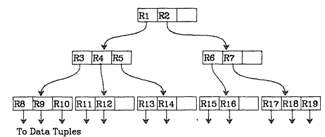

# rtreelib: A C++ R-tree Library

This is a R-tree library which implemented with C++ to achieve the performance. If you don't know what's R-tree, you can refer to [wiki](https://en.wikipedia.org/wiki/R-tree) or [original paper](https://dl.acm.org/doi/pdf/10.1145/971697.602266).

## Basic Information

Source code of rtreelib hosted on [GitHub](https://github.com/ShangHungWan/rtreelib).

This library can help user to establish a R-tree easily and do the other operations like: insert, search, delete.

The implementation follows the original paper as possible.

## Problem to Solve

According to the paper, R-tree is a dynamic index structure for spatial searching. Therefore, it can help users to search something like "what's the nearest restaurant?", "Find all gas stations within 1km of my location".

In contrary, if there is no R-tree, we may need to traverse all restaurants' positions and calculate all the distance between it and user's current location. It will be an impossible task for extremely large geographical applications like Google Maps.

R-tree has similar structure with B-tree.(image 1)



However, it's in the higher dimension. It will draws rectangles and find the intersections to decide which sub-tree need to been traversed.(image 2)


## Prospective Users

Those who want to develop an application that need to store/search two-dimension geographical data.

They can use both C++ or Python to include this library. C++ can directly include the library. In the other hands, this library also provide APIs for Python.

## System Architecture

### Interfaces

This library will provides C++ interfaces:

- RTRect RTRect::RTRect(double top, double right, double bottom, double left)
- RTree RTree::RTree()
- void RTree::insert(int uid, RTRect rect)
- int RTree::nearest(RTRect rect)
- int* RTree::intersection(RTRect rect)
- void RTree::delete(int uid)

And wrap it as Python APIs:

- RTRect RTRect::RTRect(double top, double right, double bottom, double left)
- RTree RTree::RTree()
- void RTree::insert(int uid, RTRect rect)
- int RTree::nearest(RTRect rect)
- dict[int] RTree::intersection(RTRect rect)
- void RTree::delete(int uid)

## API Description

Users can include rtreelib while compiling the code, for example:

```bash
g++ main.cpp -o main -lrtreelib
```

Furthermore, users who developing in Python can import it as well, for example:

```python
import rtreelib
```

About interfaces, please refer to [Interfaces](#interfaces).

## Engineering Infrastructure

### Build System

- make
- CI by GitHub Actions

### Version control

- Git
- GitHub
- GitHub Flow

### Testing Framework

- pytest (for Python)
- Google Test (for C++)

### Documentation

- Markdown

## Schedule

|  Week   | Start Date | End Date | Description |
|  ----  | ----  | ---- | ---- |
| Planning phase  | 10/16 | 10/29 |  Keep editing and rectifying the proposal. |
| Week 1  | 10/30 | 11/05 |  Read the paper and survey other references to understand R-tree well. |
| Week 2  | 11/06 | 11/12 |  Implement `RTree::insert` and `RTRect`. |
| Week 3  | 11/13 | 11/19 |  Implement `RTree::nearest` and `RTree::intersection`. |
| Week 4  | 11/20 | 11/26 |  Implement `RTree::delete` and write unit tests that have about 50% code coverage. |
| Week 5  | 11/27 | 12/03 |  Write unit tests that achieve 100% coverage. (ideally) |
| Week 6  | 12/04 | 12/10 |  Wrap the library as Python APIs. |
| Week 7  | 12/11 | 12/17 |  Write unit tests for Python APIs. |
| Week 8  | 12/18 | 12/25 |  Prepare the presentation and slides. |

## References

- [R-trees: a dynamic index structure for spatial searching](https://dl.acm.org/doi/pdf/10.1145/971697.602266)
- [Wikipedia: R-tree](https://en.wikipedia.org/wiki/R-tree)
